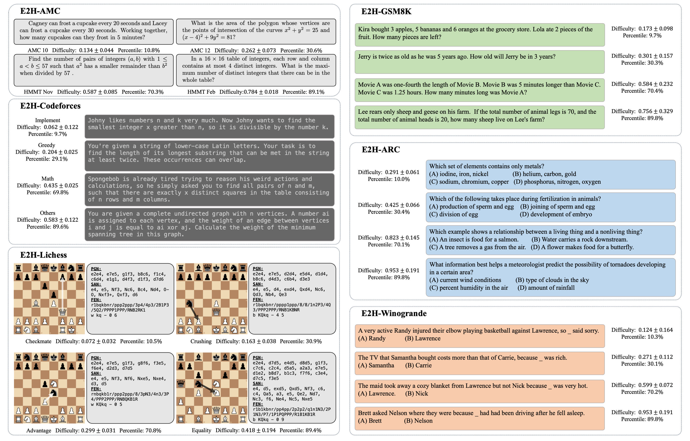

<p align="center">

  <h1 align="center">Easy2Hard-Bench: Standardized Difficulty Labels for Profiling LLM Performance and Generalization</h1>
  <h3 align="center"><a href="https://openreview.net/forum?id=iNB4uoFQJb#discussion">NeurIPS 2024 Track Datasets and Benchmarks</a></h3>
  
  <p align="center">
    <a href="http://www.cs.umd.edu/~mcding/"><strong>Mucong Ding*</strong></a>
    ·
    <a href="https://deng-chenghao.com/"><strong>Chenghao Deng*</strong></a>
    ·
    <a href=""><strong>Jocelyn Choo</strong></a>
    ·
    <a href=""><strong>Zichu Wu</strong></a>
    ·
    <a href="https://sites.google.com/bits-pilani.ac.in/aakriti/home"><strong>Aakriti Agarawal</strong></a>
    ·
    <a href="https://cs.umd.edu/~avi1"><strong>Avi Schwarzschild</strong></a>
    ·
    <a href="https://tianyizhou.github.io/"><strong>Tianyi Zhou</strong></a>
    ·
    <a href="https://www.cs.umd.edu/~tomg/"><strong>Tom Goldstein</strong></a>
    ·
    <a href="http://hunch.net/~jl"><strong>John Langford</strong></a>
    ·
    <a href="http://tensorlab.cms.caltech.edu/users/anima/"><strong>Anima Anandkumar</strong></a>
    ·
    <a href="https://furong-huang.com"><strong>Furong Huang</strong></a>
  </p>

</p>

<h3 align="center">
  <a href="https://arxiv.org/abs/2409.18433"><strong>[Paper]</strong></a>
  ·
  <a href="https://huggingface.co/collections/furonghuang-lab/easy2hard-bench-666a0d26f3932ecb92c112c2"><strong>[Dataset]</strong></a>
  ·
  <a href=""><strong>[Project page]</strong></a>
  ·
  <a href=""><strong>[X (Twitter)]</strong></a>

</h3>

<div align="center">
  
</div>

The codebase for the paper "Easy2Hard-Bench: Standardized Difficulty Labels for Profiling LLM Performance and Generalization" (https://arxiv.org/abs/2409.18433) by Mucong Ding*, Chenghao Deng*,  Jocelyn Choo, Zichu Wu, Aakriti Agrawal, Avi Schwarzschild, Tianyi Zhou, Tom Goldstein, John Langford, Anima Anandkumar, Furong Huang.

### We are still working on the final version of evaluation code for Easy2Hard-Bench. See you soon!

## Citing

Please cite our work if you find it is helpful:
```
@inproceedings{
          anonymous2024easyhardbench,
          title={Easy2Hard-Bench: Standardized Difficulty Labels for Profiling {LLM} Performance and Generalization},
          author={Mucong Ding and Chenghao Deng and Jocelyn Choo and Zichu Wu and Aakriti Agrawal and Avi Schwarzschild and Tianyi Zhou and Tom Goldstein and John Langford and Anima Anandkumar and Furong Huang},
          booktitle={The Thirty-eight Conference on Neural Information Processing Systems Datasets and Benchmarks Track},
          year={2024},
}
```